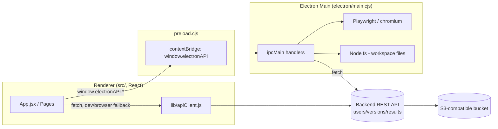

# Project Details — MES Core Testing

A desktop application (Electron + React) for managing a QA/test-automation workspace: browsing/editing local files, recording Playwright scripts by clicking through a live browser, and viewing test results/reports stored remotely (backed by an S3-compatible bucket via a separate backend API).

## 1. Tech Stack

- **Shell:** Electron (`electron/main.cjs`, `electron/preload.cjs`)
- **UI:** React 19 + Vite (`src/`)
- **Automation:** Playwright (`chromium.launch`) driven from the Electron main process
- **Config:** `dotenv` loads `.env` into `process.env` for the main process
- **Packaging:** `electron-builder` (NSIS + portable Windows targets, output in `release/`)

## 2. High-Level Architecture



- The **renderer** (React app) never talks to Node/Electron APIs directly — it goes through `window.electronAPI` (exposed by `preload.cjs` via `contextBridge`) for anything privileged (file system, Playwright, base-URL/health checks).
- If `window.electronAPI` isn't available (e.g. running the UI in a plain browser during `vite` dev), `src/lib/apiClient.js` falls back to calling the backend REST API directly with `fetch`, and to `localStorage` for the base URL.
- The **main process** performs all network calls to the backend and all file system access, enforcing that file operations stay within folders the user explicitly opened (`selectedRoots` / `isAllowedPath`).

## 3. App Pages / Features (`src/App.jsx`, `src/components/`)

| Page | Component | Purpose |
|---|---|---|
| Splash | `SplashScreen.jsx` | Shown for a few seconds on launch |
| Home | `HomePage.jsx` | Landing page |
| About | `AboutPage.jsx` | App info |
| Team Setup | `TeamSetupPage.jsx` | Lets a user set/override the backend **Base URL** and run a health check |
| Workspace Setup | `WorkspaceSetupPage.jsx` | Pick/create a "user" and "version" (maps to folders in the results bucket) |
| Editor | `EditorPage.jsx`, `FileTree.jsx`, `CodeEditor.jsx` | Open a local folder, browse/edit/create/delete files |
| Script Recorder | `ScriptRecorderPage.jsx` | Opens a real Chrome window via Playwright, lets you click elements on a page, and generates Playwright locator/action code snippets |
| Results | `DashboardPage.jsx`, `ResultFileList.jsx`, `ResultViewer.jsx`, `ResultPage.jsx` | Lists and renders test result files (HTML reports) pulled from the backend/bucket |

Navigation is hash-based (`#/home`, `#/about`, `#/setup`, `#/results`, `#/editor`, `#/result`, `#/recorder`, `#/teamsetup`), handled in `App.jsx` via `getPageFromHash()`.

## 4. Electron Main Process (`electron/main.cjs`)

Responsibilities:
- **Config**: reads `.env` via `dotenv`; persists a user-chosen Base URL to `config.json` in Electron's `userData` directory (`getConfigPath`, `readAppConfig`, `writeAppConfig`).
- **Base URL / health**: `get-base-url`, `set-base-url`, `check-health` IPC handlers — health checks run in the main process (Node `fetch`) to avoid renderer CORS restrictions.
- **Backend proxy calls**: `get-users`, `get-user-versions`, `create-user`, `create-user-version`, `get-user-files`, `get-user-result` — all call the backend's `/api/...` routes (see [API_TESTING.md](API_TESTING.md)) using the resolved base URL.
- **Local workspace file system**: `choose-folder`, `restore-folder`, `read-file`, `write-file`, `create-file`, `delete-path`, `refresh-folder` — all validated against `selectedRoots` so the renderer can't read/write arbitrary paths on disk.
- **Script Recorder**: launches a real Chrome browser via Playwright (`chromium.launch({ channel: "chrome" })`), injects a page script (`addInitScript`) that highlights hovered elements and, on click, computes an XPath plus several friendlier locator suggestions (by id, class, text, test id, label, placeholder, etc.), then sends the selection back to the renderer over IPC (`recorder-element-selected`, `recorder-page-opened`, `recorder-navigation-happened`).
- **Window bootstrap**: `createWindow()` loads `dist/index.html` when packaged, or `http://localhost:5173` (Vite dev server) otherwise.

## 5. Preload Bridge (`electron/preload.cjs`)

Exposes a single `window.electronAPI` object (via `contextBridge`, with `contextIsolation: true` / `nodeIntegration: false`) wrapping every IPC channel above, plus zoom controls (`setZoomFactor`/`getZoomFactor`) and recorder event subscriptions (`onRecorderElementSelected`, `onRecorderPageOpened`, `onRecorderNavigationHappened`, `onRecorderContentChanged`).

## 6. Backend API (external, consumed by this app)

This repository does **not** contain the backend server — it's a separate service the app talks to over HTTP. It exposes REST routes backed by an S3-style bucket, fully documented in [API_TESTING.md](API_TESTING.md):

- `GET /api/users` — list users
- `POST /api/users/:user` — create a user folder
- `POST /api/users/:user/:version` — create a version folder under a user
- `GET /api/users/:user/versions` — list a user's versions
- `GET /api/results/:version` — results across all users for a version
- `GET /api/users/:user/:version/files` — list result file names
- `GET /api/users/:user/:version/:fileName` — fetch a specific result file (HTML)
- `GET /api/health` — health check used by Team Setup

## 7. Build & Run

```bash
# install dependencies
npm install

# run in development (Vite dev server + Electron, auto-reload on electron/ changes)
npm run dev

# build the React app only
npm run build

# build + package a distributable Windows app (installer + portable exe, output -> release/)
npm run dist
```

`npm run dev` runs `vite` (React) and `nodemon` (watching `electron/*.cjs`) concurrently, waiting for `http://localhost:5173` before launching Electron.

## 8. Environment Variables (`.env`)

Create a `.env` file at the project root (same folder as `package.json`). **Never commit real secret values** — only the variable names are listed below; supply your own values locally.

| Variable | Used by | Purpose |
|---|---|---|
| `PORT` | `electron/main.cjs` | Fallback port for the backend base URL if no override/`BASE_URL` is set (`http://localhost:<PORT>`) |
| `BASE_URL` | `electron/main.cjs` | Full backend base URL override (takes priority over `PORT`); can also be changed at runtime from the Team Setup page |
| `BUCKET_NAME` | backend API | Name of the S3(-compatible) bucket storing user/version/result data |
| `AWS_ACCESS_KEY_ID` | backend API | AWS access key used to authenticate S3 requests |
| `AWS_SECRET_ACCESS_KEY` | backend API | AWS secret key used to authenticate S3 requests |
| `AWS_REGION` | backend API | AWS region of the S3 bucket |
| `USER_NAME` | backend API / default user context | Default/current user identifier used by the backend |

> Note: `BUCKET_NAME`, `AWS_ACCESS_KEY_ID`, `AWS_SECRET_ACCESS_KEY`, `AWS_REGION`, and `USER_NAME` are consumed by the backend service (not read directly in this Electron app's code), but they belong in the same `.env` if the backend runs alongside this project. Only `PORT` and `BASE_URL` are read directly by `electron/main.cjs`.

### Security warning

The current `.env` file in this workspace contains **live AWS credentials in plain text** and is **not excluded by `.gitignore`**. Add `.env` to `.gitignore` immediately and rotate the AWS keys if this repository has ever been pushed/shared, to avoid leaking credentials.
